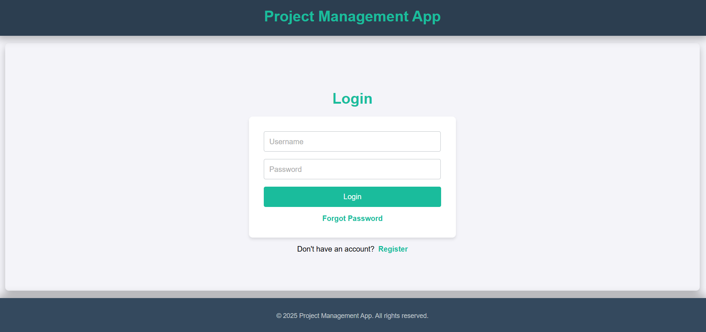
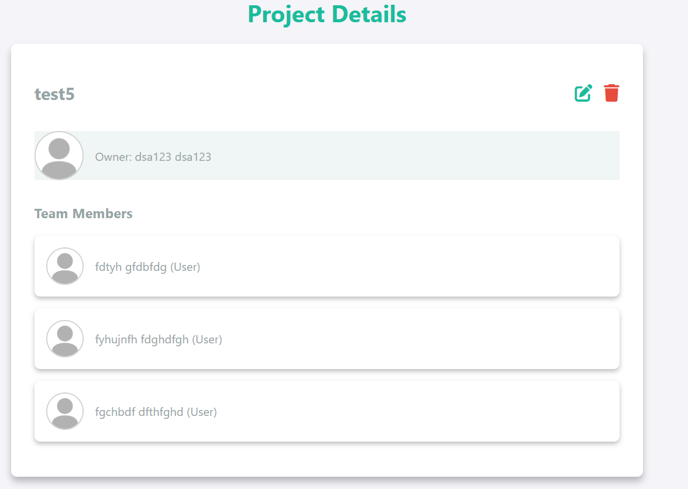
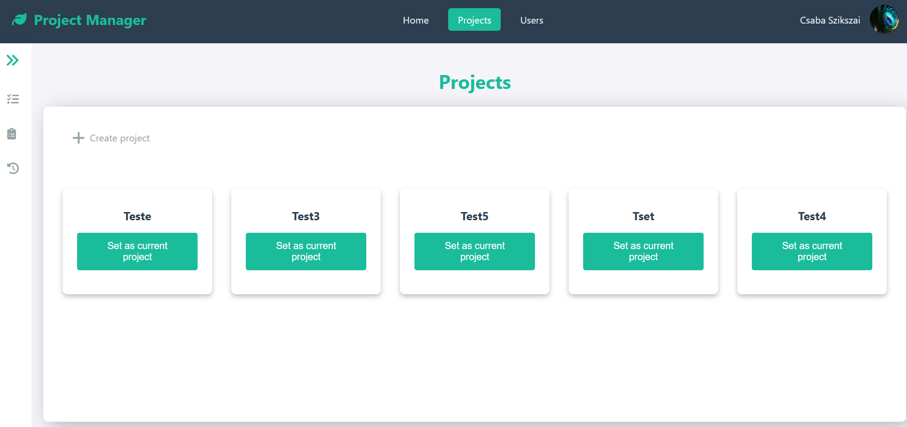
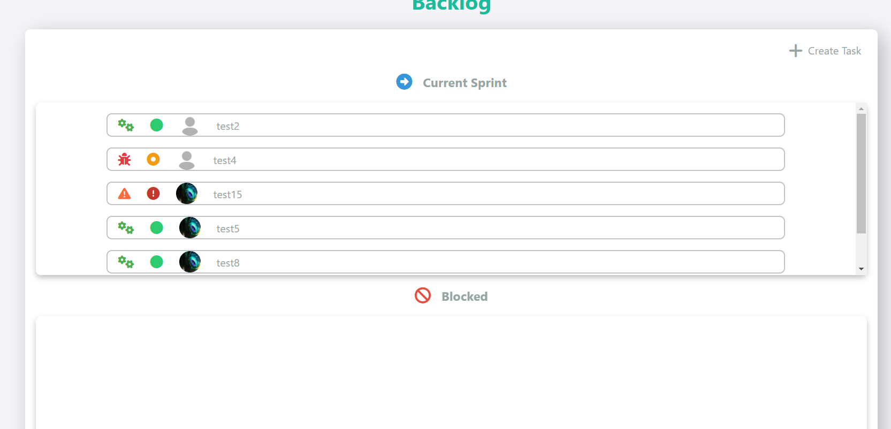
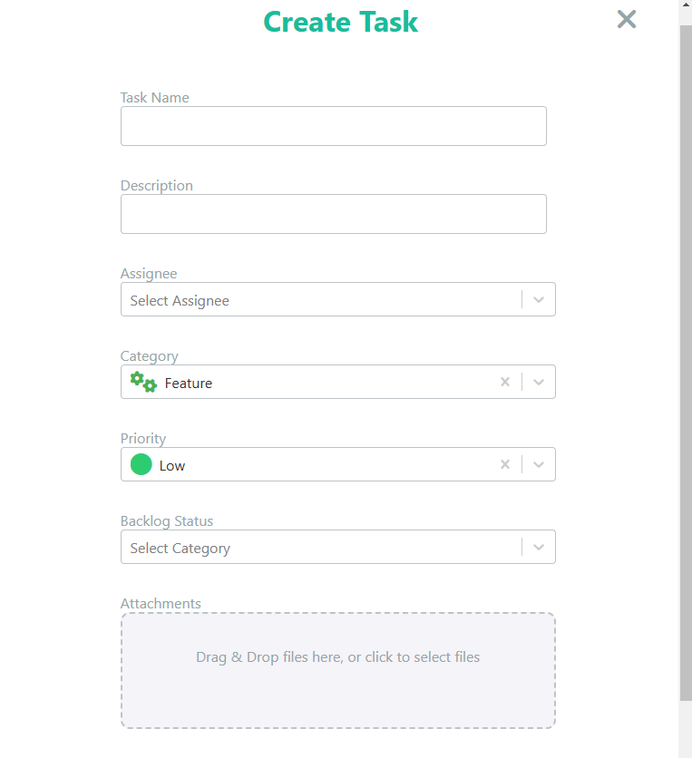
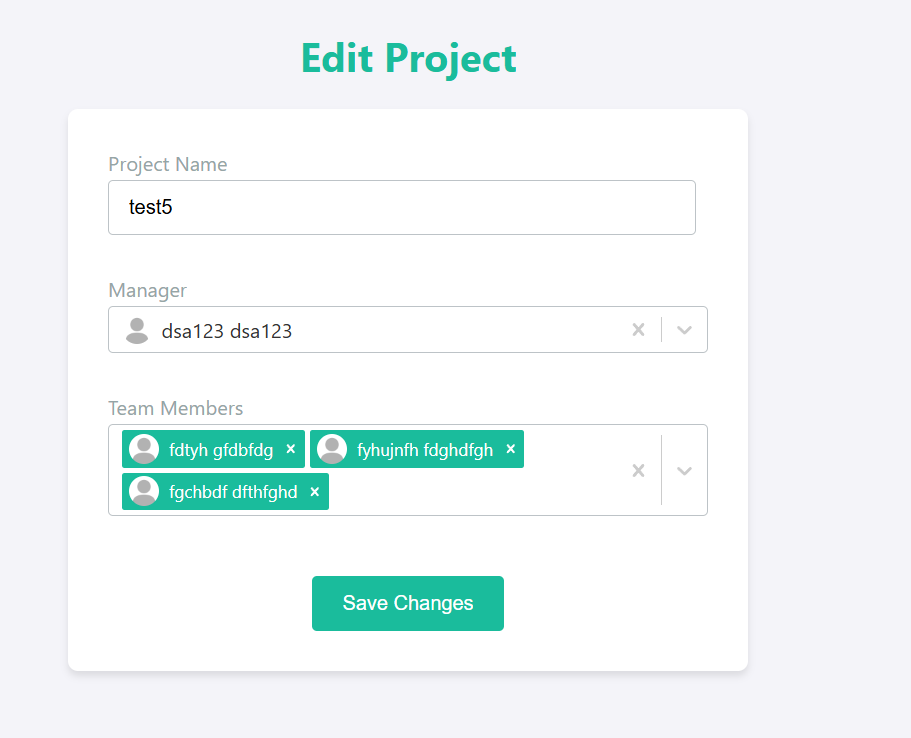
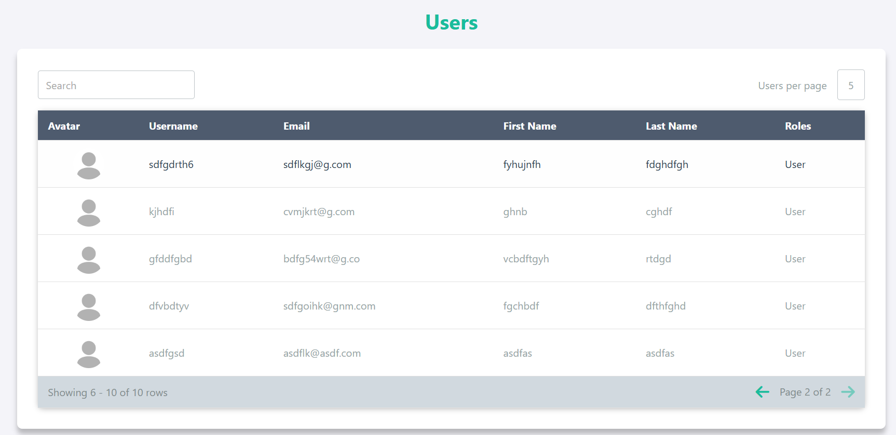
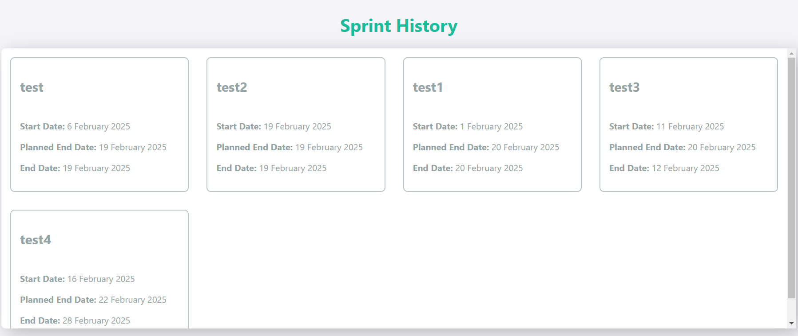
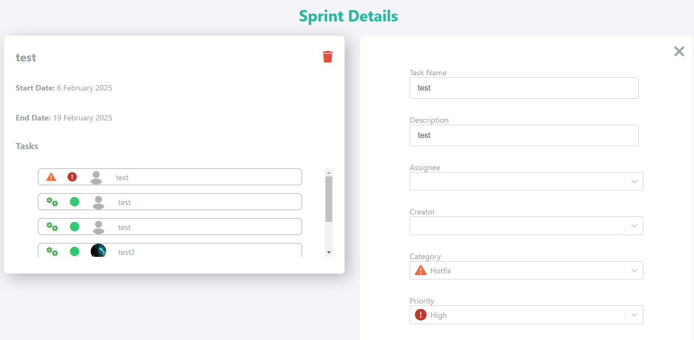

# Project Management App

A project management application designed to handle user information, project management, and task management with a microservices architecture. This app implements various modern concepts such as dependency injection, role-based security, and real-time updates with WebSockets. The goal of the project is to learn and implement best practices for building scalable and maintainable web applications.

## Table of Contents

- [Technologies](#technologies)
- [Features](#features)
- [Microservices](#microservices)
- [Architecture](#architecture)
- [Authentication & Authorization](#authentication--authorization)
- [Frontend](#frontend)
- [Backend](#backend)
- [Testing](#testing)
- [Future Enhancements](#future-enhancements)

## Technologies

- **Backend**: Node.js, Express.js, Awilix, MongoDB, Mongoose, Kafka, JWT
- **Frontend**: React, Redux, Axios, Yup
- **Authentication**: JWT, HTTP-only cookies
- **Real-time Communication**: WebSockets
- **Caching**: Redis
- **API Gateway**: Proxy for microservices with rate-limiting and security
- **Testing**: Jest, Supertest

## Features

- **Role-Based Access Control**: 3 roles - Admin, Manager, and User, each with different permissions.
  - **Admin**: Can manage all users, projects, sprints, and tasks.
  - **Manager**: Can manage projects and tasks within the project.
  - **User**: Can manage tasks and sprints within the assigned projects.
- **Real-Time Updates**: Updates on tasks, sprints, and backlog boards are reflected live via WebSockets.
- **Sprint History Page**: Allows users to view past sprints and their details.
- **Custom Components**: Reusable UI components like Icons, Inputs, Buttons, and Select dropdowns.
- **Error Handling**: Global error handling with middleware.
- **Notifications**: Success and error messages are displayed through a notification bar.
- **Caching with Redis**: Frequently accessed data is cached to improve performance and reduce database load.

## Microservices

The application is divided into three microservices:

1. **User Service**: Manages user data and profiles.
2. **Project Service**: Manages project, sprint, and backlog data.
3. **Task Service**: Manages task data.

An **API Gateway** is used as a proxy to route requests to these microservices and manage common functionality such as authentication, authorization, and rate-limiting.

## Architecture

The backend microservices use a **layered architecture** with the following layers:

- **Routes**: Handle incoming HTTP requests.
- **Controllers**: Contain the logic for processing requests and returning responses.
- **Services**: Business logic for handling the core functionality.
- **Repositories**: Interface with the database to fetch or modify data.
- **Models**: Define the data structure and schema for MongoDB.
- **Caching Layer**: Implements Redis caching for frequently accessed data to enhance performance.

This structure helps organize the application and makes it more maintainable.

## Authentication & Authorization

The system uses **JWT tokens** stored in **HTTP-only cookies** for secure user authentication. The roles (Admin, Manager, User) have specific permissions for different actions:

Role-based security ensures that each user can access only the functionality they are authorized for.

## Frontend

The frontend is built with **React** and uses **Redux** for state management. The UI components are customized, and form validation is implemented using **Yup**. **Axios** is used to handle API requests, and the **notification bar** displays success/error messages for the user.

## Backend

The backend is built with **Express.js**, and the business logic is modularized using **Awilix** for dependency injection. The microservices architecture is used for better scalability and maintenance. Kafka handles asynchronous communication between services, and **MongoDB** is used to store all data. **Redis** is integrated to cache frequently accessed data, improving performance and reducing database load.

The backend microservices follow a **layered architecture** with routes, services, controllers, repositories, and models for better maintainability and scalability.

## Testing

The application is thoroughly tested using **Jest**:

- **Unit Tests**: Validate individual functions and business logic.
- **Mocking**: Services and database calls are mocked where necessary to isolate components.

## Future Enhancements

- **CI/CD Pipeline**: Automate deployments and ensure continuous integration.

## Screenshots

